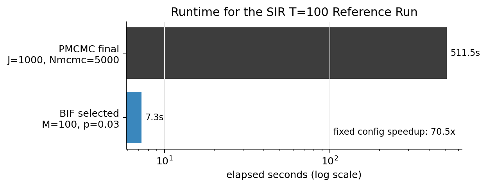
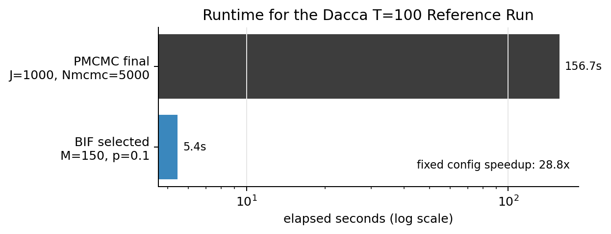
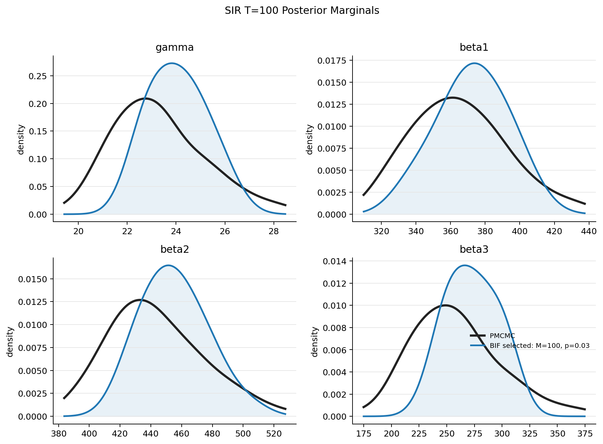
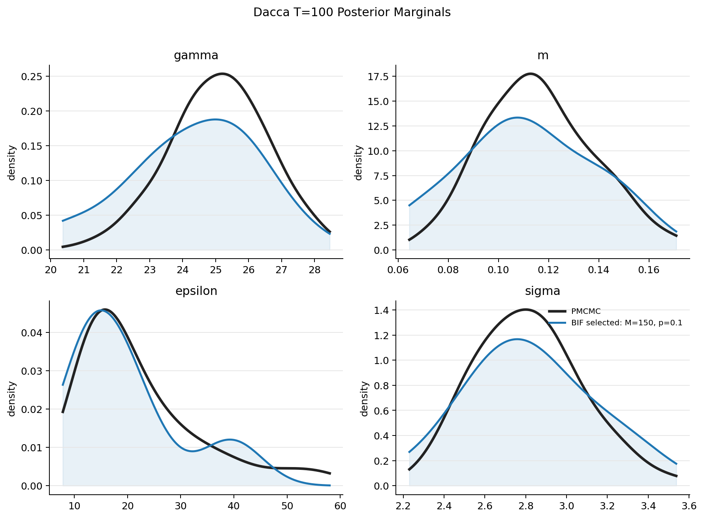
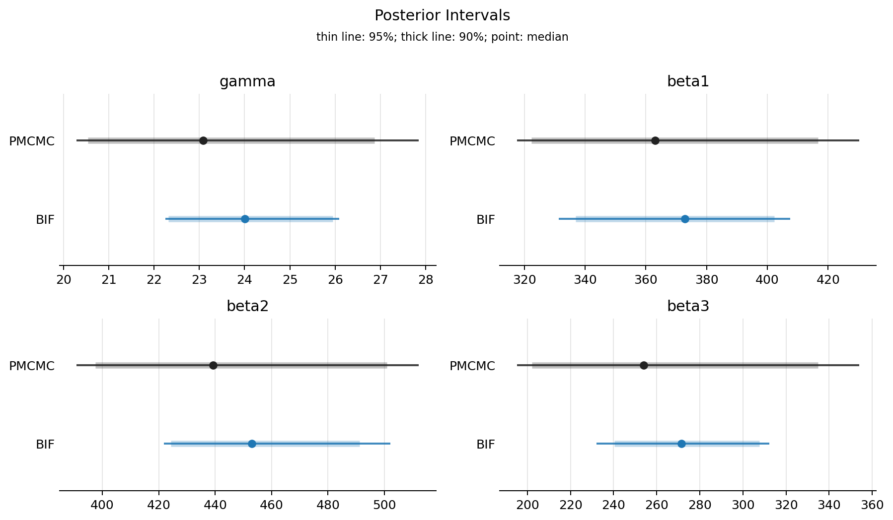
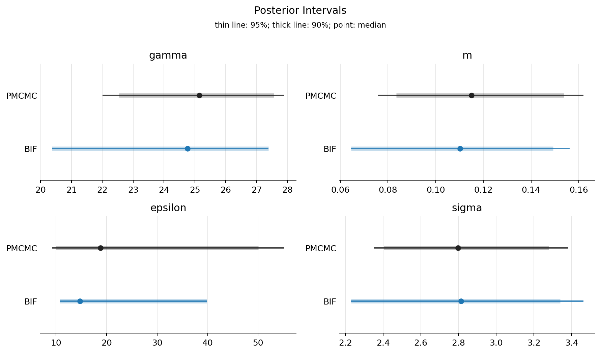
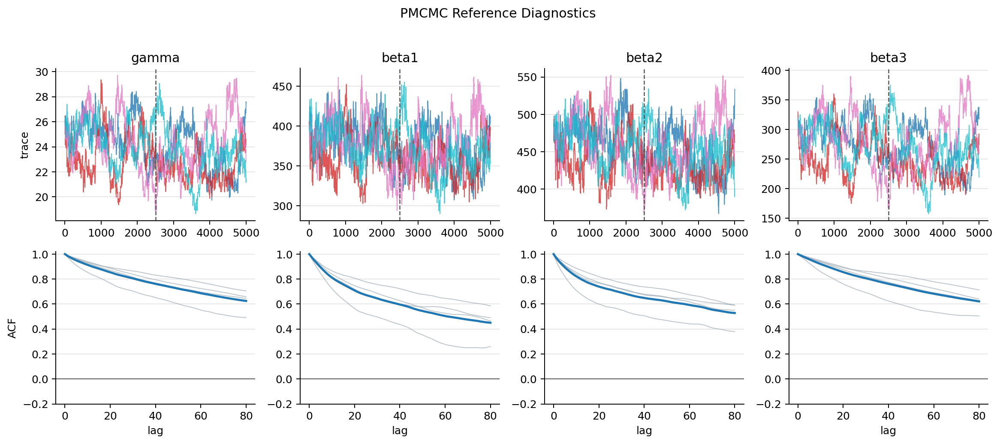
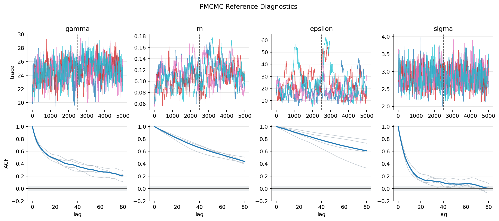
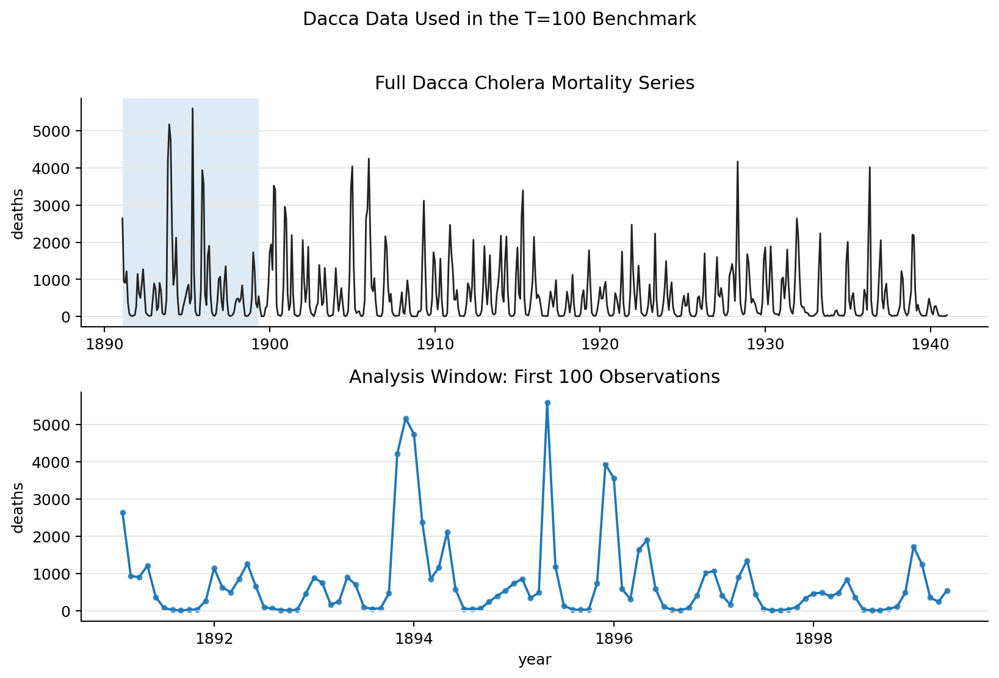

```{python}
# | label: setup
# | echo: false
import json
import logging
from datetime import datetime
from pathlib import Path

import numpy as np
import pandas as pd
from IPython.display import Markdown, display

logging.getLogger("jax._src.xla_bridge").setLevel(logging.CRITICAL)

ROOT = Path(".")
RESULTS = ROOT / "results"
RUNS = {
    "SIR four-parameter": RESULTS / "sir-T100-fourparam-gpu-J1000-20260605",
    "Dacca four-parameter": RESULTS / "dacca-T100-fourparam-gpu-J1000-20260604",
}

print("Report generated on:", datetime.now())
```

This report summarizes two preliminary BIF versus PMCMC benchmarks for
`pypomp`. The calculations use GPU-enabled JAX runs and keep the time horizon
small enough to test the workflow before scaling to larger Dacca experiments.

The comparison is deliberately narrow: both methods use `J=1000` particles,
PMCMC uses four chains with 5000 iterations after a 1000-iteration scale sweep,
and BIF uses a small tuning grid. The PMCMC runtime shown below is the selected
final PMCMC run, not the total PMCMC tuning sweep.

```{python}
# | label: load
# | echo: false
def read_json(path):
    with open(path) as f:
        return json.load(f)


def load_meeting(label, run_dir):
    if label.startswith("SIR"):
        path = run_dir / "figures" / "main" / "four_param_meeting_summary.csv"
    else:
        path = run_dir / "figures" / "main" / "dacca_meeting_summary.csv"
    df = pd.read_csv(path)
    df.insert(0, "example", label)
    return df


meeting = pd.concat(
    [load_meeting(label, run_dir) for label, run_dir in RUNS.items()],
    ignore_index=True,
)
configs = {label: read_json(run_dir / "config.json") for label, run_dir in RUNS.items()}
pmcmc_scales = {
    label: read_json(run_dir / "selected_pmcmc_scale.json") for label, run_dir in RUNS.items()
}
```

# Configuration

```{python}
# | label: config-table
# | echo: false
rows = []
for label, cfg in configs.items():
    rows.append(
        {
            "example": label,
            "T": cfg["T"],
            "active parameters": ", ".join(cfg["active_params"]),
            "J": cfg["J"],
            "PMCMC chains": cfg["pmcmc_chains"],
            "PMCMC sweep": cfg["pmcmc_nmcmc_sweep"],
            "PMCMC final": cfg["pmcmc_nmcmc_final"],
            "PMCMC scale": pmcmc_scales[label].get("selected_scale", cfg.get("pmcmc_final_scale")),
        }
    )
display(pd.DataFrame(rows))
```

# Runtime

The speedup column compares the selected BIF configuration against the selected
final PMCMC run. It does not count the whole BIF tuning grid or the PMCMC scale
sweep.

```{python}
# | label: runtime-table
# | echo: false
runtime_rows = []
for label, run_dir in RUNS.items():
    pmcmc = pd.read_csv(run_dir / "pmcmc_metrics.csv")
    bif = pd.read_csv(run_dir / "bif_metrics.csv")
    rank_name = "four_param_bif_rank.csv" if label.startswith("SIR") else "dacca_bif_rank.csv"
    rank = pd.read_csv(run_dir / rank_name)
    selected = rank.sort_values(["ess_frac", "score"], ascending=[False, True]).iloc[0]
    selected_bif = bif[
        bif["M"].eq(int(selected["M"]))
        & np.isclose(bif["perturb"], float(selected["perturb"]))
    ].iloc[0]
    final_pmcmc = pmcmc[pmcmc["method"].eq("pmcmc_final")].iloc[0]
    runtime_rows.append(
        {
            "example": label,
            "PMCMC final runtime": float(final_pmcmc["elapsed_sec"]),
            "BIF selected runtime": float(selected_bif["elapsed_sec"]),
            "PMCMC total runtime": float(pmcmc["elapsed_sec"].sum()),
            "BIF grid total runtime": float(bif["elapsed_sec"].sum()),
        }
    )

wide_runtime = pd.DataFrame(runtime_rows)
wide_runtime["selected-run speedup"] = (
    wide_runtime["PMCMC final runtime"] / wide_runtime["BIF selected runtime"]
)
wide_runtime["tuning-included speedup"] = (
    wide_runtime["PMCMC total runtime"] / wide_runtime["BIF grid total runtime"]
)
display(wide_runtime.round(2))
```





# Posterior Comparison

The figures compare PMCMC marginal posteriors against the selected BIF
importance-weighted approximation. These plots should be read as evidence for
proposal quality and posterior shape agreement in these small test cases, not
as a final large-scale validation.





## Interval Comparison





# PMCMC Diagnostics





# Dacca Data



# BIF Selection

The selected BIF configuration is currently chosen by internal ESS stability
and then compared against PMCMC. The full tuning grid is stored in
`bif_metrics.csv` and the derived ranking table.

```{python}
# | label: bif-selection
# | echo: false
selection_rows = []
for label, run_dir in RUNS.items():
    metric = pd.read_csv(run_dir / "bif_metrics.csv")
    rank_name = "four_param_bif_rank.csv" if label.startswith("SIR") else "dacca_bif_rank.csv"
    rank = pd.read_csv(run_dir / rank_name)
    selected = rank.sort_values(["ess_frac", "score"], ascending=[False, True]).iloc[0]
    selection_rows.append(
        {
            "example": label,
            "selected M": int(selected["M"]),
            "selected perturb": float(selected["perturb"]),
            "ESS fraction": float(selected["ess_frac"]),
            "score": float(selected["score"]),
            "grid rows": len(metric),
        }
    )
display(pd.DataFrame(selection_rows).round(3))
```

# Interpretation

For these two small examples, BIF produces posterior marginals that are close
enough to the PMCMC reference to justify larger experiments. The measured
speedup is substantial because BIF reuses a short IF2-style particle-cloud run
and then applies a deconvolution weighting step, while PMCMC repeatedly
evaluates the likelihood along an autocorrelated chain.

The comparison is not yet the final paper-scale benchmark. The next checks
should include larger Dacca horizons, repeated seeds, and a clearer accounting
of PMCMC tuning cost versus selected-run cost.

# Source Files

`bif_pmcmc_test.py` contains the Great Lakes job configuration and delegates to
the BIF paper repository scripts. `sync_results.py` copies compact summaries
and figures into this quant report after the raw runs finish.
