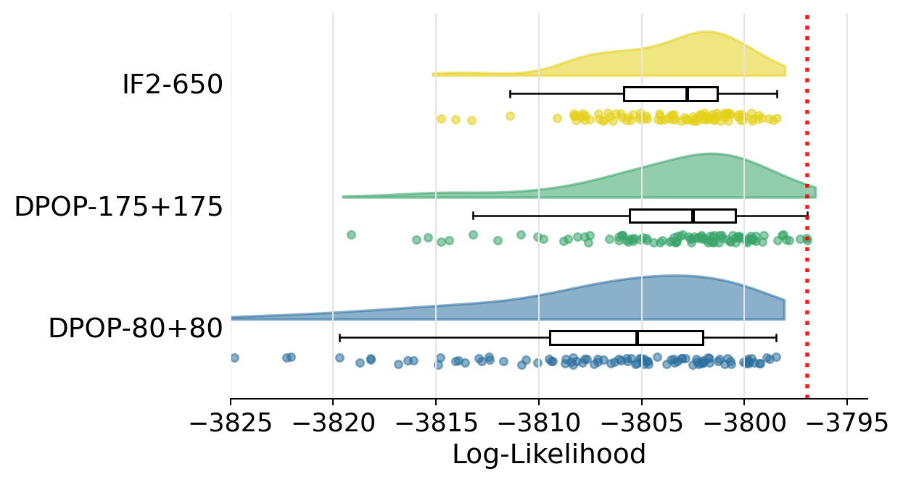
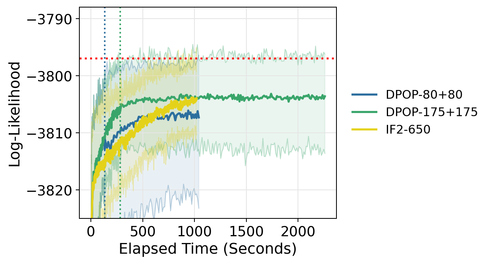

**GPU Model Used:** NVIDIA RTX 6000 (Blackwell)

```{python}
# | label: setup
# | echo: false
import logging
from datetime import datetime
from pathlib import Path

import numpy as np
import pandas as pd
from IPython.display import Markdown, display

logging.getLogger("jax._src.xla_bridge").setLevel(logging.CRITICAL)

ROOT = Path(".")
EXPORT = ROOT / "plot_exports"
FIGURES = ROOT / "figures"

ORDER = ["DPOP-80+80", "DPOP-175+175", "IF2-650"]
COLORS = {
    "DPOP-80+80": "#2c6f9e",
    "DPOP-175+175": "#39a56a",
    "IF2-650": "#e4d21a",
}

print("Report generated on:", datetime.now())
```

This report summarizes a single-unit London measles benchmark for DPOP.  The
comparison uses the same 100 starting points for all methods, `J=5000`
particles for search and final pfilter evaluation, and 36 pfilter evaluation
replicates.

The benchmark compares:

* `IF2-650`: a standalone IF2 baseline with 650 IF2 iterations.
* `DPOP-80+80`: 80 IF2 warm-start iterations followed by 80 DPOP iterations.
* `DPOP-175+175`: 175 IF2 warm-start iterations followed by 175 DPOP iterations.

DPOP uses `alpha=0.8`, Adam with cosine learning-rate decay, and process weights
from the `logw` state in the `001d` London measles model.

```{python}
# | label: load-data
# | echo: false
summary = pd.read_csv(EXPORT / "summary.csv")
pre = pd.read_csv(EXPORT / "final_loglik_prepruned.csv")
post = pd.read_csv(EXPORT / "final_loglik_postpruned.csv")
times = pd.read_csv(EXPORT / "times.csv")
trace_stats = pd.read_csv(EXPORT / "trace_stats_dmop_style.csv")

for df in [summary, pre, post, times, trace_stats]:
    if "Model" in df.columns:
        df["Model"] = pd.Categorical(df["Model"], categories=ORDER, ordered=True)
```

# Numerical Results

## Configuration

```{python}
# | label: config-table
# | echo: false
config = pd.DataFrame(
    [
        {
            "Model": "IF2-650",
            "Warm IF2": 650,
            "DPOP": 0,
            "J search": 5000,
            "J eval": 5000,
            "Eval reps": 36,
            "Adam eta": "",
            "rho eta": "",
            "cosine final": "",
        },
        {
            "Model": "DPOP-80+80",
            "Warm IF2": 80,
            "DPOP": 80,
            "J search": 5000,
            "J eval": 5000,
            "Eval reps": 36,
            "Adam eta": 0.002,
            "rho eta": 0.0005,
            "cosine final": 0.05,
        },
        {
            "Model": "DPOP-175+175",
            "Warm IF2": 175,
            "DPOP": 175,
            "J search": 5000,
            "J eval": 5000,
            "Eval reps": 36,
            "Adam eta": 0.001,
            "rho eta": 0.00025,
            "cosine final": 0.05,
        },
    ]
)
display(config)
```

## Final pfilter summaries

The pre-pruned rows summarize the final pfilter distribution over all 100
search replicates. The post-pruned row is the fresh pfilter evaluation of the
single selected replicate.

```{python}
# | label: summary-table
# | echo: false
summary_display = summary.copy()
for col in summary_display.columns:
    if col != "Model" and np.issubdtype(summary_display[col].dtype, np.number):
        summary_display[col] = summary_display[col].map(lambda x: f"{x:.3f}")
display(summary_display)
```

## Runtime

```{python}
# | label: time-table
# | echo: false
times_display = times.copy()
times_display["time"] = times_display["time"].map(lambda x: f"{x:.2f}")
display(times_display)

total_time = (
    times.assign(time_numeric=pd.to_numeric(times["time"]))
    .groupby("Model", observed=True)["time_numeric"]
    .sum()
    .reset_index()
)
total_time["total seconds"] = total_time["time_numeric"].map(lambda x: f"{x:.2f}")
display(total_time[["Model", "total seconds"]])
```

# Likelihood Distribution

The raincloud plot follows the presentation used for the DMOP Dacca benchmark:
the distribution is based on all pre-pruned final pfilter evaluations.  The red
dotted line marks the best pre-pruned pfilter value observed in this comparison.

```{python}
# | label: raincloud-data
# | echo: false
threshold = -3825.0
outliers = pre[pre["plotLogLik"] < threshold].copy()
rain = pre[pre["plotLogLik"] >= threshold].copy()

if not outliers.empty:
    omitted = (
        outliers.groupby("Model", observed=True)
        .size()
        .reindex(ORDER, fill_value=0)
        .reset_index(name="omitted")
    )
    display(
        Markdown(
            "Values below "
            f"`{threshold}` are omitted from the raincloud visualization only."
        )
    )
    display(omitted)

model_map = {model: i for i, model in enumerate(ORDER)}
rain["Model_num"] = rain["Model"].map(model_map).astype(float)
rain["Model_violin_x"] = rain["Model_num"] + 0.05
rain["Model_boxplot_x"] = rain["Model_num"] - 0.10
rng = np.random.default_rng(42)
rain["Model_jitter_x"] = rain["Model_num"] - 0.30 + rng.uniform(
    -0.04, 0.04, size=len(rain)
)
best_loglik = pre["plotLogLik"].max()
tick_min = int(np.floor(rain["plotLogLik"].min() / 5) * 5)
tick_max = int(np.ceil(rain["plotLogLik"].max() / 5) * 5)
```



# Optimization Traces

The trace plot uses elapsed time on the x-axis.  Each curve is the median
log-likelihood over search replicates at that time, and the shaded band runs
from the 10th percentile to the maximum.  For DPOP, the stored training
objective is a negative log-likelihood, so the summary used here is sign-corrected
to the log-likelihood direction.



# Interpretation

The `DPOP-80+80` run is close to the runtime of the `IF2-650` reference.  The
`DPOP-175+175` run is not runtime matched to `IF2-650`; it is included as a
more conservative DPOP search with a longer IF2 warm start and a smaller
learning rate.  In these runs, the conservative DPOP schedule gives the best
post-pruned pfilter evaluation and a better right tail than the standalone IF2
baseline.

The DPOP training step is currently substantially more expensive than an IF2
iteration for this model.  This is consistent with automatic differentiation
through the Euler process-ratio correction and the `logw` process-weight state.
Future benchmarks should separate algorithmic performance from implementation
cost by including a per-iteration runtime and memory profile.

## Process-score coverage

The current `001d` London measles implementation should be interpreted as a
benchmark of the DPOP training machinery rather than a final accounting of every
process-density contribution in the model.  The `logw` state used by
`dpop_train` contains the Euler multinomial transition contribution along the
simulated epidemic path.  This is the main DPOP-specific process-ratio term and
is the part that distinguishes these runs from the measurement-only IFAD/DMOP
style correction.

There are several model components whose process-score contribution is not yet
fully represented in this benchmark.  The Poisson birth mechanism is tied to
`cohort`, so an incomplete birth log probability means the DPOP process score
for `cohort` is only partial.  The environmental gamma noise affects
`sigmaSE`, and its density contribution is also not fully represented in the
current `logw` accumulator.  Finally, the initial-value parameters
`S_0`, `E_0`, `I_0`, and `R_0` are sampled through the initial-state
construction, but this benchmark does not include an explicit initial-state
density or initial-state ratio in the DPOP objective.

For this reason, the likelihood comparisons above are valid comparisons of the
completed runs, but parameter-level interpretation for `cohort`, `sigmaSE`, and
the initial-value parameters should be conservative.  A follow-up benchmark
should add the missing birth, environmental-noise, and initial-state
contributions to `logw`, then repeat the same IF2/DPOP comparison to isolate
the effect of a fully specified process score.

# Source Files

The experiment scripts in this directory can be submitted with
`scripts/run_tests.py` from the root of the `quant` repository.  The stored CSV
files in `plot_exports/` are copied from the completed level-4 Great Lakes runs
and allow this report to render without the large pickled result objects.
